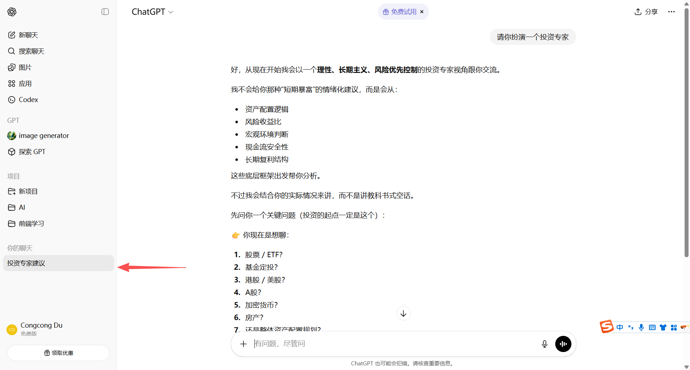

# Agent

## 什么是 Agent

Agent（Ai 智能体）是一个“以大模型为核心决策引擎，进行自主决策并采取行动”的系统。做一个简单的比喻：大模型就相当于一个“大脑”，Agent 就相当于“装上大脑的执行系统”，它能够根据大模型的决策，进行自主决策并采取行动。

从技术层面看，Agent 通常由以下四个部分而成：
- 大脑 (LLM)：负责逻辑推理、意图识别和语言表达。
- 规划 (Planning)：Agent 会把大任务拆解成“第一步、第二步、第三步”。如果中间出错了，他还会自我反思并修正计划。
- 记忆 (Memory)：
  - 短时记忆：当前的对话上下文。
  - 长时记忆：通常通过 RAG（检索增强生成）技术，存储你的个人知识库或历史行为。
- 工具使用：这是 Agent 的“手脚”。通过 Skills（技能包）和 MCP（万能接口），他可以去查实时天气、操作 Excel、甚至在你的服务器上部署代码。

一个很直观的例子是 ChatGPT，就是一个 Agent，我们每次和 ChatGPT 对话，它就会根据我们输入的上下文，进行逻辑推理、意图识别和语言表达，然后根据我们的意图，进行自主决策并采取行动。

 

## 为什么需要 Agent

## Agent 的分类

## 多智能体系统

多智能体系统（MAS, Multi-Agent System）

